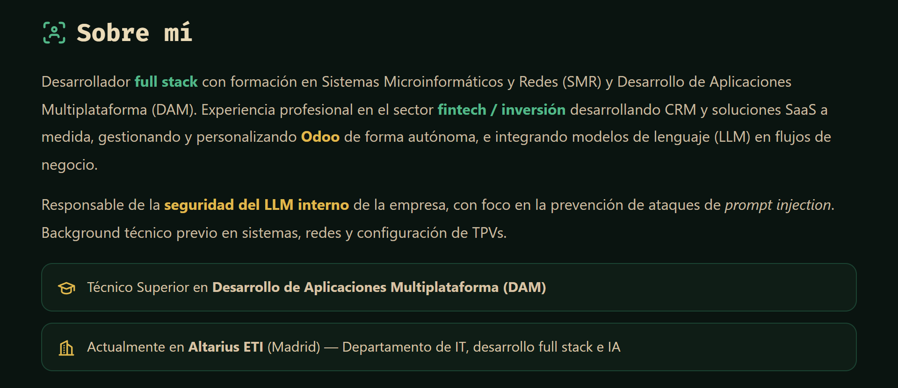
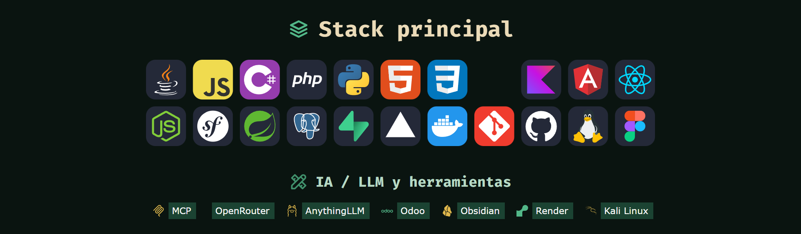
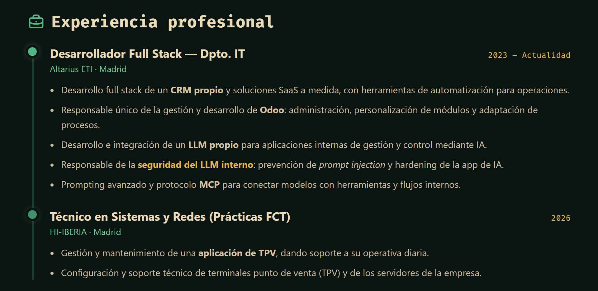
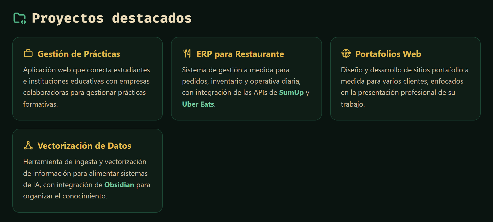
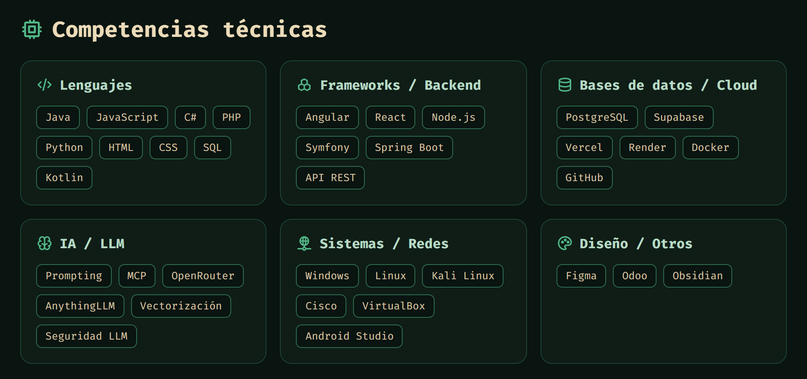
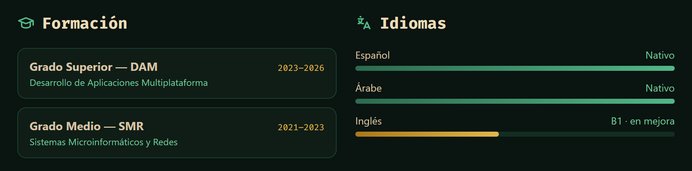
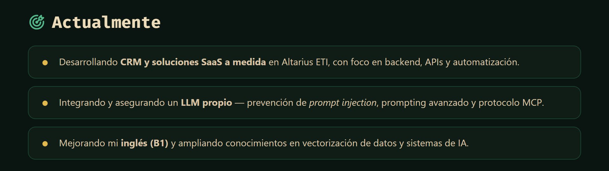

<!-- ======================= HEADER ======================= -->

  

<!-- ======================= TYPING ======================= -->

  

<!-- ======================= META BADGES ======================= -->

  
  
  
  

<!-- ======================= SOCIAL ======================= -->

  
  
  

<!-- ======================= DIVIDER ======================= -->

  

<!-- ======================= SOBRE MÍ ======================= -->

  

<!-- ======================= DIVIDER ======================= -->

  

<!-- ======================= STACK ======================= -->

  

<!-- ======================= DIVIDER ======================= -->

  

<!-- ======================= EXPERIENCIA ======================= -->

  

<!-- ======================= DIVIDER ======================= -->

  

<!-- ======================= PROYECTOS ======================= -->

  

<!-- ======================= DIVIDER ======================= -->

  

<!-- ======================= COMPETENCIAS ======================= -->

  

<!-- ======================= DIVIDER ======================= -->

  

<!-- ======================= FORMACIÓN + IDIOMAS ======================= -->

  

<!-- ======================= DIVIDER ======================= -->

  

<!-- ======================= ESTADÍSTICAS ======================= -->

  

  
  

  

  

<!-- ======================= TABLERO / SNAKE ======================= -->

  

  <picture>
    <source media="(prefers-color-scheme: dark)" srcset="https://raw.githubusercontent.com/mxxmxxn/mxxmxxn/output/snake-dark.svg" />
    <source media="(prefers-color-scheme: light)" srcset="https://raw.githubusercontent.com/mxxmxxn/mxxmxxn/output/snake.svg" />
    
  </picture>

<!-- ======================= DIVIDER ======================= -->

  

<!-- ======================= ACTUALMENTE ======================= -->

  

<!-- ======================= DIVIDER ======================= -->

  

<!-- ======================= CONTACTO ======================= -->

  

  
  
  

  

<!-- ======================= FOOTER ======================= -->

  

